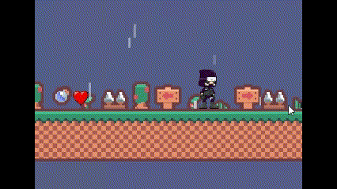
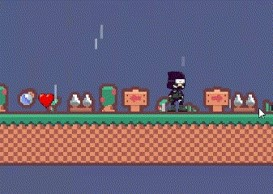

# Ancient_Lizards

# 2D Platformer Game Project Overview
Project Description
Our project is a 2D platformer game, where players navigate through levels, overcoming obstacles, and collecting bonuses. In this commit, we'll provide an overview of our game development process.

# Development Stages
# 1. Conceptualization
We initiated the project by brainstorming ideas, selecting a theme, and developing the core storyline. This stage laid the foundation for our 2D platformer, defining its unique identity and purpose.

# 2. Level and Character Design
Moving on, we focused on designing engaging levels and characters. Ensuring both an interesting gameplay experience and visually appealing characters were crucial aspects of this stage.

# 3. Coding - The Heart of the Game
The essence of any game lies in its code. We invested significant time in programming movements, interactions, and other gameplay elements. This phase was essential for bringing the envisioned gameplay mechanics to life.

# 4. Graphics and Animation
Aesthetics play a pivotal role in captivating players. We dedicated efforts to create vibrant and lively visuals, aiming to enhance the overall appeal of our game. This involved the development of graphics and animations that breathe life into our characters and environments.

# 5. Testing
Upon completion of all elements, we proceeded to the testing phase. This critical stage allowed us to identify and rectify any errors, ensuring a smooth and enjoyable gaming experience for our players. Feedback gathered during testing helped us make necessary improvements for the game's overall enhancement.

# Conclusion
Our 2D platformer game is a result of meticulous planning, creative design, and diligent development. This commit serves as a snapshot of our journey, showcasing the dedication and effort invested in creating an immersive and enjoyable gaming experience.

